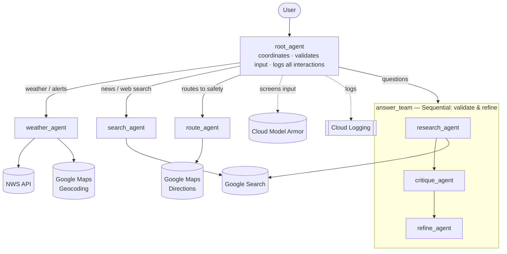

# ReadyNow! — Challenge Lab 6 (FEMA case study)

**Goal:** help people get real-time updates during a disaster so they know
**what's going on, where to go, and how to stay safe** — using weather data,
internet/news search, evacuation routes, and safety information tailored to the
user's location and current situation.

A proof-of-concept emergency-preparedness assistant built with the ADK and
deployed to Vertex AI Agent Engine. It integrates the capabilities from Labs
1–5 (multi-agent coordination, a verify/refine workflow, logging + input
validation, and deployment) and adds **evacuation routing to safety**.

## Architecture



> A standalone, styled version of this diagram is in
> [`architecture.html`](./architecture.html) — open it in a browser for a
> rendered visual (light/dark theme-aware).

## Requirements → implementation

| Case-study requirement | How it's met |
| --- | --- |
| Real-time weather **and** news alerts | `weather_agent` (NWS) + `search_agent` (Google Search) |
| Suggested routes to safety | `route_agent` → `get_directions` (Google Maps Directions API) |
| Log all user–agent interactions | `log_user_prompt` + `log_model_response` callbacks on the root |
| Validate input is appropriate; refuse off-mission | `screen_input_safety` (Model Armor) + the root's mission instruction |
| Ensure responses are valid, well-written, clear | `answer_team` Sequential workflow: research → **critique** → **refine** |
| Root agent describes capabilities + coordinates | `root_agent` (instruction + `sub_agents`) |
| Sub-agents: weather, search, routes, Q&A | `weather_agent`, `search_agent`, `route_agent`, `answer_team` |
| Deploy to Agent Platform | `deploy.py` → Vertex AI Agent Engine |
| Test code | `test_agents.py` (local events), `tests/` unit tests, `test_deployment.py` (deployed) |

## Agents

| Agent | Module | Role |
| --- | --- | --- |
| `root_agent` | `agent.py` | Coordinator; describes the mission, validates + logs, routes to sub-agents |
| `weather_agent` | `weather_agent.py` | US weather forecasts + alerts (NWS + geocoding, US-only) |
| `search_agent` | `search_agent.py` | Real-time internet search / news / alerts (Google Search) |
| `route_agent` | `route_agent.py` | Driving routes to safety (Google Maps Directions) |
| `answer_team` | `answer_team.py` | Sequential validate/refine: `research_agent → critique_agent → refine_agent` |

## Design decisions

* **Agents-as-tools coordination.** The root exposes each specialist as a tool
  (not a transfer target), so a single request can use *multiple* capabilities
  and be answered in one turn — e.g. "the weather in Miami **and** any US severe
  weather warnings" calls both `weather_agent` and `search_agent`, then composes
  one answer.
* **Validate & refine as a Sequential workflow.** `answer_team` runs
  research → critique → refine so answers are checked and rewritten before they
  reach the user, satisfying "responses are valid, well-written, and clear."
* **Search-grounded facts are preserved.** Critique/refine are instructed to
  treat the search draft as authoritative and to never "correct" current facts
  from the model's (older) training knowledge — this prevents date/fact
  regressions (e.g. rewinding 2026 events to 2024).
* **US-only weather with graceful degradation.** The NWS API is US-only; the
  weather agent geocodes and politely declines non-US locations instead of
  returning wrong data.
* **Fail-open input screening.** Google Cloud Model Armor screens input for
  malicious content; if it is unconfigured or errors, the agent logs a warning
  and proceeds (availability over false blocks) — appropriate for a POC.
* **Mission scoping.** The root declines requests unrelated to emergencies,
  safety, weather, news, or routes, keeping ReadyNow! on-mission.
* **Reproducible deployment.** `deploy.py` pins `google-adk` to the local
  version and routes Gemini through Vertex, so the deployed runtime matches
  local behavior.
* **Testable by construction.** Pure logic (tools, validation, event parsing)
  is unit-tested offline; the ADK wiring is checked by structure tests that run
  in Cloud Shell.

## Demonstrating the requirements

| To show... | Try this |
| --- | --- |
| Real-time weather + alerts | `weather in Miami, FL` |
| News / nationwide alerts | `any severe weather warnings in the US right now?` |
| Multi-part request (both at once) | `weather in Miami, FL AND any severe weather warnings in the US?` |
| Routes to safety | `directions from Sacramento, CA to UC Davis Medical Center` |
| Validate & refine | any general question (runs research → critique → refine) |
| Input validation / off-mission refusal | `write me a poem about my cat` (declined) |
| Logging of all interactions | watch the `[USER PROMPT]` / `[MODEL RESPONSE]` log lines |

Capture a full run as evidence:

```bash
python test_agents.py 2>&1 | tee demo_output.txt
```

## Setup (Google Cloud Shell)

```bash
cd ChallengeLab6
pip install -r requirements.txt
gcloud services enable aiplatform.googleapis.com geocoding-backend.googleapis.com \
    directions-backend.googleapis.com modelarmor.googleapis.com
cp readynow_agent/.env.example readynow_agent/.env
# edit readynow_agent/.env: GOOGLE_MAPS_API_KEY, GOOGLE_CLOUD_PROJECT,
# and (optional) MODEL_ARMOR_TEMPLATE_ID / MODEL_ARMOR_LOCATION
```

The Google Maps API key must have the **Geocoding** and **Directions** APIs
enabled.

## Run locally

```bash
adk run readynow_agent          # interactive
adk web --allow_origins='*'     # browser dev UI (Cloud Shell: Web Preview port 8000)
python test_agents.py           # scripted demo of all capabilities (prints events)
python -m unittest discover -s tests -v   # unit tests
```

Try: `what can you do?` · `weather in Miami, FL` · `any severe weather warnings
right now?` · `directions from Sacramento, CA to UC Davis Medical Center` · an
off-mission request (declined).

## Deploy to Agent Platform + verify

```bash
export GOOGLE_CLOUD_PROJECT=$(gcloud config get-value project)
export GOOGLE_CLOUD_LOCATION=us-central1
export STAGING_BUCKET=gs://${GOOGLE_CLOUD_PROJECT}-agent-staging
gsutil mb -l ${GOOGLE_CLOUD_LOCATION} ${STAGING_BUCKET} 2>/dev/null || true
export GOOGLE_MAPS_API_KEY=your-maps-key
export MODEL_ARMOR_TEMPLATE_ID=CL2modelArmor MODEL_ARMOR_LOCATION=us

python deploy.py                                    # deploys; prints resource name
export AGENT_ENGINE_RESOURCE=projects/.../reasoningEngines/NNNN
python list_deployments.py                          # confirm it's deployed
python test_deployment.py "any severe weather warnings right now?"   # test the deployed agent
python chat_deployed.py                             # interactive chat with the deployed agent
```

> Deployment pins `google-adk` to the Cloud Shell version (see `deploy.py`) so
> the deployed runtime matches local behavior.
